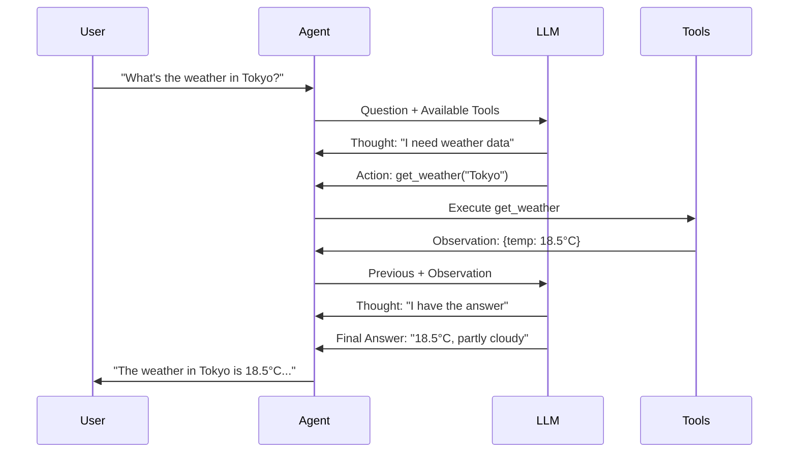

# AI Agents and the ReACT Pattern

This document explains the agentic patterns used in this demo, focusing on how AI agents reason and act to solve problems.

## What is an AI Agent?

An **AI agent** is an autonomous system that:
1. **Perceives** its environment (reads user queries, observes tool results)
2. **Reasons** about what actions to take
3. **Acts** by using tools to accomplish goals
4. **Learns** from observations to refine its approach

Unlike simple chatbots that just generate text, agents can:
- Break down complex problems into steps
- Use external tools to gather information
- Verify results and try alternative approaches
- Chain multiple actions together

## The ReACT Pattern

**ReACT** (Reasoning and Acting) is a prompting pattern that interleaves reasoning and action.

### Traditional Approach: Chain-of-Thought
```
Question: What's the weather in Tokyo?
Thought: Tokyo is in Japan, it's usually temperate...
Answer: Based on my knowledge, Tokyo is likely around 20°C
```
**Problem**: No access to current, real data.

### ReACT Approach: Reasoning + Acting
```
Question: What's the weather in Tokyo?
Thought: I need current weather data for Tokyo
Action: get_weather
Action Input: {"city": "Tokyo"}
Observation: {"temperature": 18.5, "condition": "partly cloudy"}
Thought: I now have the current weather
Final Answer: The current weather in Tokyo is 18.5°C and partly cloudy
```
**Benefit**: Grounds reasoning in real data from tools.

## The ReACT Loop



### Detailed Flow

1. **User Query**: User asks a question
2. **Initial Reasoning**: LLM decides what information is needed
3. **Action Selection**: LLM chooses a tool to use
4. **Tool Execution**: Agent calls the tool and gets results
5. **Observation**: Results are fed back to the LLM
6. **Further Reasoning**: LLM processes the observation
7. **Repeat or Answer**: Either take more actions or provide final answer

## LangGraph ReACT Agent

The **LangGraph ReACT Agent** is built on LangGraph, the modern framework for building AI agents with state management and flexible control flow.

### Key Characteristics

**Pre-built ReACT Pattern**: LangGraph provides a ready-to-use ReACT agent via `create_react_agent()`:
- Automatic prompt engineering for tool use
- Built-in reasoning and action loop
- Native support for structured tools
- Clean message-based API

**Modular**: Tools are independent modules that can be:
- Added or removed without changing the agent
- Reused across different agents
- Developed and tested independently
- Provided via MCP (Model Context Protocol)

**Why It Works**

Modern LLMs have been trained on diverse data including:
- API documentation
- Code with function calls
- Reasoning traces
- Problem-solving examples

Combined with LangGraph's framework:
- Structured tool calling with JSON schemas
- Automatic state management
- Flexible graph-based control flow
- Integration with MCP servers

## Example Reasoning Traces

### Simple Query

```
Question: What's the temperature in Paris?

Thought: I need to get current weather data for Paris
Action: get_weather
Action Input: {"city": "Paris"}
Observation: {"city": "Paris", "temperature": 15.5, "unit": "°C"}

Thought: I now know the final answer
Final Answer: The current temperature in Paris is 15.5°C
```

### Multi-Step Query

```
Question: What's the weather in Seattle and are there events today?

Thought: I need to check the weather first
Action: get_weather
Action Input: {"city": "Seattle"}
Observation: {"temperature": 12, "condition": "rainy"}

Thought: Now I need to find events in Seattle
Action: search_events
Action Input: {"city": "Seattle", "max_results": 3}
Observation: {"results": [{"title": "Pike Place Market Tour"}, ...]}

Thought: I now have all the information needed
Final Answer: The weather in Seattle is 12°C and rainy.
There are several events today including Pike Place Market Tour...
```

### Query with Reasoning

```
Question: Should I go outside in Barcelona today?

Thought: To answer this, I need to know the current weather
Action: get_weather
Action Input: {"city": "Barcelona"}
Observation: {"temperature": 24, "condition": "sunny"}

Thought: The weather is nice, but let me check if there are outdoor events
Action: search_events
Action Input: {"city": "Barcelona", "max_results": 3}
Observation: {"results": [{"title": "Beach Volleyball"}, ...]}

Thought: I have weather and events information to make a recommendation
Final Answer: Yes! It's 24°C and sunny in Barcelona today.
Great weather for going outside. There's also a beach volleyball
event happening if you're interested.
```

## Why ReACT Works

### 1. Grounding
- Agents get **real, current data** from tools
- Not relying on potentially outdated training data
- Can access APIs, databases, real-time information

### 2. Transparency
- Every step is visible (Thought → Action → Observation)
- Easy to debug when agent makes wrong decisions
- Users can see the reasoning process

### 3. Flexibility
- Same agent works with different tool sets
- Can handle unforeseen question types
- Adapts strategy based on observations

### 4. Composability
- Tools can be chained together
- Complex problems broken into simple steps
- Each tool does one thing well

## Pattern Comparison

| Pattern | Example | Best For |
|---------|---------|----------|
| **Direct Answer** | "Tokyo is probably 20°C" | General knowledge questions |
| **Chain-of-Thought** | "Tokyo is in Japan, which is temperate..." | Reasoning problems without external data |
| **ReACT** | "Thought: Need data → Action: get_weather..." | Questions requiring current/external data |
| **Multi-Agent** | Multiple specialized agents collaborate | Complex, multi-domain problems |

## Agent Limitations

### What Agents Can Do
✅ Use tools to gather information
✅ Break problems into logical steps
✅ Reason about which tools to use
✅ Combine information from multiple sources
✅ Adapt based on tool outputs

### What Agents Can't Do
❌ Execute more steps than max_iterations limit
❌ Use tools not provided to them
❌ Remember previous conversations (without memory)
❌ Understand tool behavior beyond descriptions
❌ Make up data when tools fail

## Design Principles

### Tool Design
**Good tool**: `get_weather(city: str) -> Weather`
- Single, clear purpose
- Well-defined inputs/outputs
- Descriptive name and documentation

**Bad tool**: `do_stuff(params: dict) -> Any`
- Unclear purpose
- Ambiguous inputs
- Agent won't know when to use it

### Prompt Engineering
The ReACT prompt teaches the agent:
- Format for expressing thoughts
- How to specify actions
- Expected observation format
- When to provide final answer

### Error Handling
Agents should handle:
- Tool failures gracefully
- Invalid inputs with clear errors
- Ambiguous queries by asking for clarification
- Missing information by using available tools

## Advanced Patterns

### Tool Composition
```
Question: Compare weather in Tokyo and Paris

Thought: I need weather for both cities
Action: get_weather
Action Input: {"city": "Tokyo"}
Observation: {"temperature": 18}

Thought: Now get Paris weather
Action: get_weather
Action Input: {"city": "Paris"}
Observation: {"temperature": 15}

Thought: I can now compare
Final Answer: Tokyo is warmer at 18°C vs Paris at 15°C
```

### Conditional Logic
```
Question: Should I bring an umbrella in London?

Thought: Need to check weather conditions
Action: get_weather
Action Input: {"city": "London"}
Observation: {"condition": "rainy", "precipitation": "80%"}

Thought: High chance of rain means umbrella needed
Final Answer: Yes, definitely bring an umbrella.
It's rainy with 80% precipitation in London.
```

### Information Synthesis
```
Question: What's a good day activity in Amsterdam?

Thought: Let me check the weather first
Action: get_weather
Action Input: {"city": "Amsterdam"}
Observation: {"temperature": 20, "condition": "sunny"}

Thought: Good weather, let me find outdoor events
Action: search_events
Action Input: {"city": "Amsterdam"}
Observation: {"results": [{"title": "Canal Tour"}, {"title": "Bike Rental"}]}

Thought: I can recommend based on weather + events
Final Answer: Great day for outdoor activities! Try a canal tour
or rent a bike - it's 20°C and sunny.
```

## Further Reading

- **ReACT Paper**: "ReAct: Synergizing Reasoning and Acting in Language Models" (Yao et al., 2022)
- **LangGraph Documentation**: https://langchain-ai.github.io/langgraph/
- **LangGraph ReACT Agent**: https://langchain-ai.github.io/langgraph/how-tos/create-react-agent/
- **MCP (Model Context Protocol)**: https://modelcontextprotocol.io/
- **LangChain MCP Adapters**: https://docs.langchain.com/oss/python/langchain/mcp

## Related Concepts

- **Function Calling**: LLMs generating structured API calls
- **Agents**: Autonomous systems with reasoning capabilities
- **Tool Use**: LLMs accessing external information/actions
- **Chain-of-Thought**: Prompting pattern for step-by-step reasoning
- **Multi-Agent Systems**: Multiple agents collaborating on tasks
